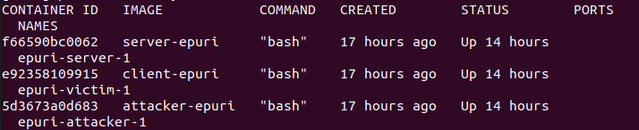
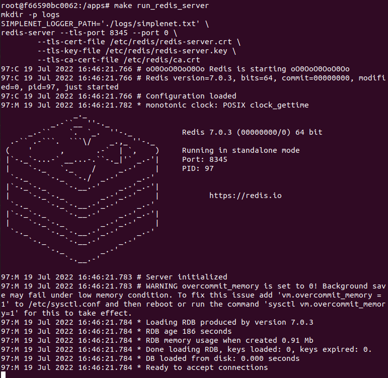
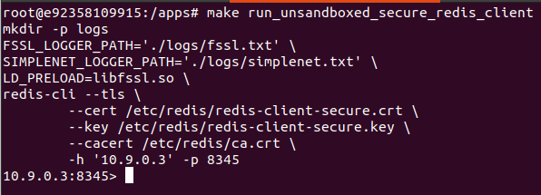
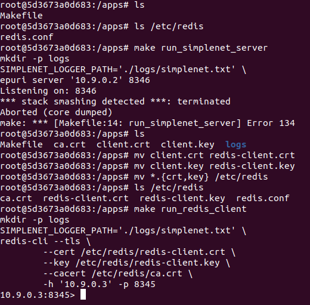
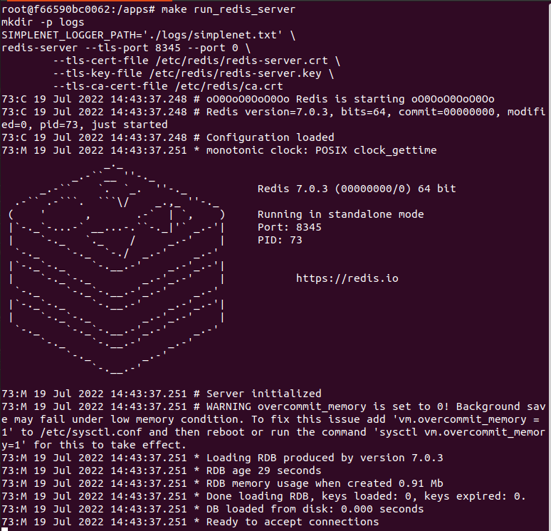
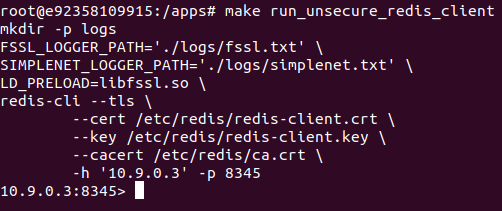
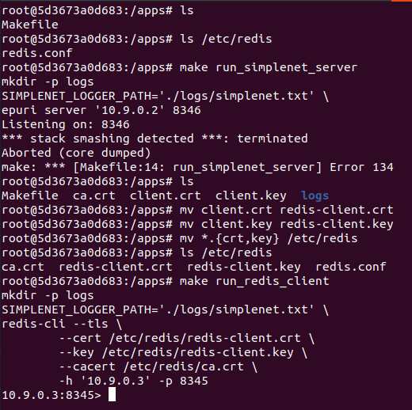
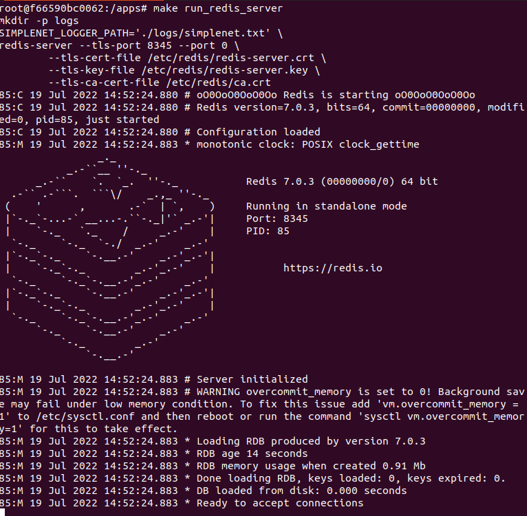
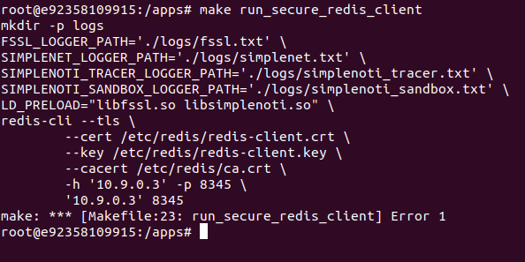
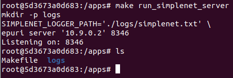

 To start a shell for each of the server, client, attacker and start attack models 1,2,3, run these commands such as in this case:
 
```
sudo docker container ls
```
The output of the above command looks similar to this:



## Server's container
```
sudo docker exec -it f6 bash
cd apps
```

## Client's container
```
sudo docker exec -it e9 bash
cd apps
```

## Attacker's container
```
sudo docker exec -it 5d3 bash
cd apps
```

If you're running models 1,2,3 in a row, make sure to remove obtained credentials at the end of each experiment

```
rm /etc/redis/*.{key,crt}
```

# Model 1

## Step 1: Start redis server in server's container
```
make run_redis_server
```


## Step 2: Test if we can connect to redis server in the attacker's container (failure)

```
make run_redis_client
```
## Step 3: Run a server program in the attacker's container

```
make run_simplenet_server
```

## Step 4: Connect to redis server using config 1 unsanboxed in client's container
```
make run_unsandboxed_secure_redis_client
```


## Step 5: Use obtained credentials and connect to redis server in the attacker's container (success)

Check if client's private key, certificate, and certificate authority are obtained
and try to connect to redis server

```
mv *.{crt,key} /etc/redis
cd /etc/redis
mv client.key redis-client.key
mv client.crt redis-client.crt
cd /apps
make run_redis_client
```


# Model 2

## Step 1: Start redis server in server's container
```
make run_redis_server
```


## Step 2: Test if we can connect to redis server in the attacker's container (failure)

```
make run_redis_client
```
## Step 3: Run a server program in the attacker's container

```
make run_simplenet_server
```

## Step 4: Connect to redis server using config 1 unsanboxed in client's container
```
make run_unsecure_redis_client
```


## Step 5: Use obtained credentials and connect to redis server in the attacker's container (success)

Check if client's private key, certificate, and certificate authority are obtained
and try to connect to redis server

```
mv *.{crt,key} /etc/redis
cd /etc/redis
mv client.key redis-client.key
mv client.crt redis-client.crt
cd /apps
make run_redis_client
```


# Model 3

## Step 1: Start redis server in server's container
```
make run_redis_server
```


## Step 2: Test if we can connect to redis server in the attacker's container (failure)

```
make run_redis_client
```
## Step 3: Run a server program in the attacker's container

```
make run_simplenet_server
```
## Step 4: Connect to redis server using config 1 unsanboxed in client's container
```
make run_secure_redis_client
```


## Step 5: Check that no credentials are obtained in attacker's container


